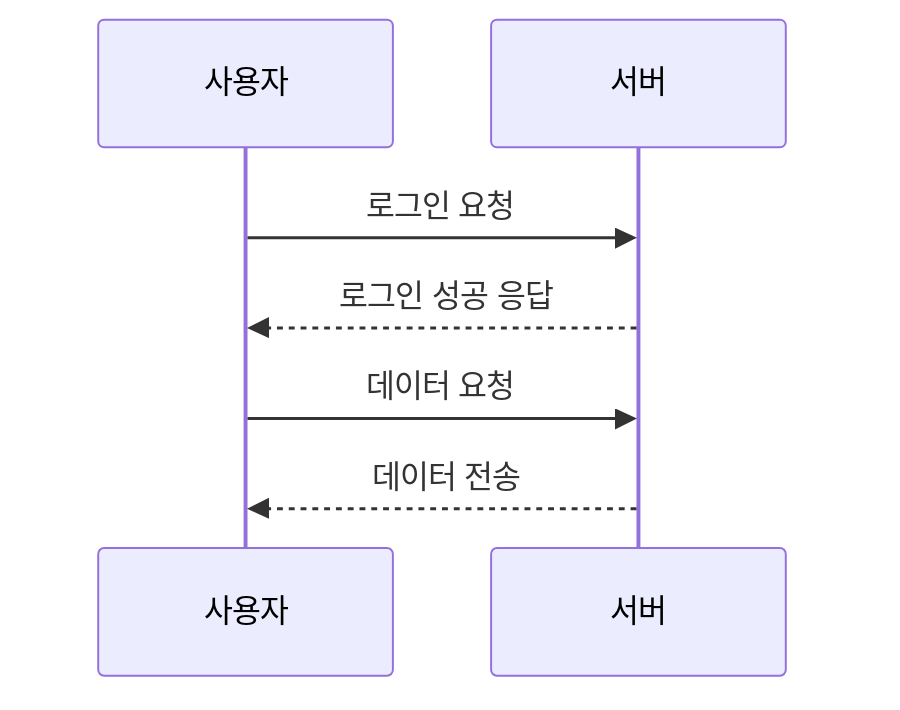

# 아키텍처 가이드

Spring Multi-Module 프로젝트의 아키텍처와 설계 원칙을 설명합니다.

## 🏗️ 전체 아키텍처


### 📦 모듈 의존성


### 계층 구조

```
┌─────────────────────────────────────────┐
│         Application Layer               │
│  (사용자 애플리케이션 또는 API)            │
└──────────────┬──────────────────────────┘
               │
               ▼
┌─────────────────────────────────────────┐
│         Domain Module                   │
│  ┌──────────────────────────────────┐   │
│  │ Service Layer                    │   │
│  ├──────────────────────────────────┤   │
│  │ Repository Layer                 │   │
│  ├──────────────────────────────────┤   │
│  │ Entity Layer                     │   │
│  └──────────────────────────────────┘   │
└──────────────┬──────────────────────────┘
               │
    ┌──────────┴──────────┐
    ▼                     ▼
┌──────────┐        ┌──────────┐
│ Encrypt  │        │   Util   │
│  Module  │◄───────│  Module  │
└──────────┘        └──────────┘
```

## 📦 모듈별 책임

### Util Module (기반 계층)

**목적**: 공통 유틸리티 기능 제공

**책임**:
- 문자열 처리
- 날짜/시간 처리
- 기타 범용 유틸리티

**의존성**: 없음 (최하위 모듈)

**설계 원칙**:
- 순수 함수 중심 설계
- 외부 의존성 최소화
- 재사용성 극대화

### Encrypt Module (보안 계층)

**목적**: 암호화 및 보안 기능 제공

**책임**:
- 데이터 암호화/복호화
- 해시 생성
- 인코딩/디코딩

**의존성**: Util Module

**설계 원칙**:
- 보안 표준 준수
- 알고리즘 추상화
- 확장 가능한 설계

### Domain Module (비즈니스 계층)

**목적**: 비즈니스 로직 및 도메인 모델

**책임**:
- 엔티티 정의
- 비즈니스 로직 구현
- 데이터 액세스

**의존성**: Util Module, Encrypt Module

**설계 원칙**:
- DDD(Domain-Driven Design) 원칙
- 계층 분리 (Entity, Repository, Service)
- 트랜잭션 관리

## 🔄 의존성 관리

### 의존성 방향

```
Util ← Encrypt ← Domain
```

**규칙**:
1. 하위 모듈은 상위 모듈을 알지 못함
2. 순환 의존성 금지
3. 인터페이스를 통한 느슨한 결합

### Gradle 의존성 설정

```gradle
// util-module/build.gradle
dependencies {
    // 외부 의존성만 있음
    implementation 'org.springframework.boot:spring-boot-starter'
}

// encrypt-module/build.gradle
dependencies {
    implementation project(':util-module')  // util에 의존
    implementation 'org.bouncycastle:bcprov-jdk18on:1.77'
}

// domain-module/build.gradle
dependencies {
    implementation project(':util-module')     // util에 의존
    implementation project(':encrypt-module')  // encrypt에 의존
    implementation 'org.springframework.boot:spring-boot-starter-data-jpa'
}
```

## 🎯 설계 원칙

### 1. 단일 책임 원칙 (SRP)

각 모듈은 하나의 명확한 책임을 가집니다.

```java
// Good: 각 클래스는 하나의 책임
public class StringUtils {
    public String toCamelCase(String str) { ... }
    public boolean isEmpty(String str) { ... }
}

public class DateTimeUtils {
    public String getCurrentDateTime() { ... }
    public String formatDateTime(...) { ... }
}
```

### 2. 개방-폐쇄 원칙 (OCP)

확장에는 열려있고 수정에는 닫혀있습니다.

```java
// 인터페이스로 추상화
public interface EncryptionService {
    String encrypt(String plainText, String key);
    String decrypt(String encryptedText, String key);
}

// 구현체는 확장 가능
public class AesEncryptionService implements EncryptionService {
    // AES 구현
}

public class RsaEncryptionService implements EncryptionService {
    // RSA 구현 (향후 추가 가능)
}
```

### 3. 의존성 역전 원칙 (DIP)

고수준 모듈은 저수준 모듈에 의존하지 않고, 추상화에 의존합니다.

```java
// Domain Module의 Service는 Repository 인터페이스에 의존
public class UserService {
    private final UserRepository userRepository;  // 인터페이스
    
    public UserService(UserRepository userRepository) {
        this.userRepository = userRepository;
    }
}
```

## 🔌 Spring Boot 통합

### Component Scan 설정

```java
@SpringBootApplication(scanBasePackages = {
    "com.example.util",
    "com.example.encrypt",
    "com.example.domain"
})
public class Application {
    public static void main(String[] args) {
        SpringApplication.run(Application.class, args);
    }
}
```

### Auto-Configuration

각 모듈은 Spring Boot의 자동 구성을 활용합니다.

```java
// 각 모듈의 컴포넌트는 @Component, @Service 등으로 자동 등록
@Component
public class StringUtils { ... }

@Service
public class UserService { ... }

@Repository
public interface UserRepository extends JpaRepository<User, Long> { ... }
```

## 📊 데이터 흐름

### 사용자 등록 플로우

```
┌─────────┐      ┌──────────┐      ┌──────────┐      ┌──────────┐
│Controller│      │ Service  │      │ Hash     │      │Repository│
│         │      │          │      │ Service  │      │          │
└────┬────┘      └────┬─────┘      └────┬─────┘      └────┬─────┘
     │                │                  │                  │
     │ register(user) │                  │                  │
     ├───────────────►│                  │                  │
     │                │ sha256(password) │                  │
     │                ├─────────────────►│                  │
     │                │ hashedPassword   │                  │
     │                │◄─────────────────┤                  │
     │                │                  │                  │
     │                │ save(user)       │                  │
     │                ├─────────────────────────────────────►│
     │                │                  │   savedUser      │
     │                │◄─────────────────────────────────────┤
     │ savedUser      │                  │                  │
     │◄───────────────┤                  │                  │
     │                │                  │                  │
```

## 🧪 테스트 전략

### 단위 테스트

각 모듈은 독립적으로 테스트 가능합니다.

```java
// util-module 테스트
@Test
void testToCamelCase() {
    StringUtils utils = new StringUtils();
    assertEquals("helloWorld", utils.toCamelCase("hello_world"));
}

// encrypt-module 테스트
@Test
void testEncryptDecrypt() {
    AesEncryptionService aes = new AesEncryptionService();
    String key = aes.generateSecretKey();
    String encrypted = aes.encrypt("test", key);
    String decrypted = aes.decrypt(encrypted, key);
    assertEquals("test", decrypted);
}
```

### 통합 테스트

```java
@SpringBootTest
@AutoConfigureTestDatabase
class UserServiceIntegrationTest {
    @Autowired
    private UserService userService;
    
    @Test
    void testRegisterUser() {
        User user = new User("test", "test@example.com", "password");
        User registered = userService.registerUser(user);
        assertNotNull(registered.getId());
    }
}
```

## 🚀 확장성 고려사항

### 1. 새 모듈 추가

새로운 기능이 필요한 경우 독립적인 모듈로 추가:

```gradle
// settings.gradle
include 'util-module'
include 'encrypt-module'
include 'domain-module'
include 'notification-module'  // 새 모듈
```

### 2. 모듈 분리

모듈이 커지면 더 작은 모듈로 분리:

```
domain-module/
  ├── user-domain/
  ├── order-domain/
  └── product-domain/
```

### 3. API 모듈 추가

REST API를 위한 별도 모듈:

```
api-module/
  ├── controllers/
  ├── dto/
  └── config/
```

## 📚 참고 자료

- [Spring Boot Multi-Module Projects](https://spring.io/guides/gs/multi-module/)
- [Clean Architecture](https://blog.cleancoder.com/uncle-bob/2012/08/13/the-clean-architecture.html)
- [Domain-Driven Design](https://martinfowler.com/tags/domain%20driven%20design.html)

## 다음 단계

- [코딩 컨벤션](coding-conventions.md)
- [테스트 가이드](testing.md)
